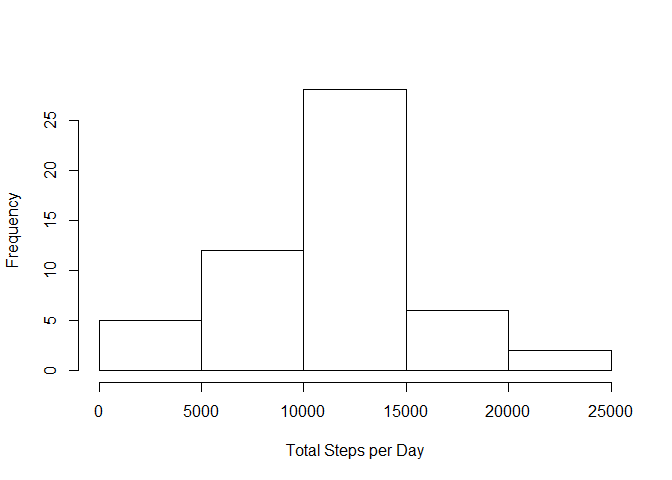
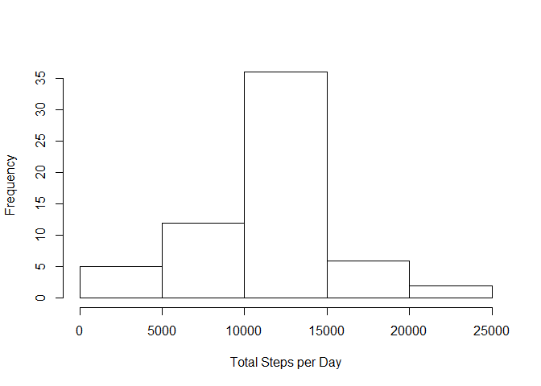
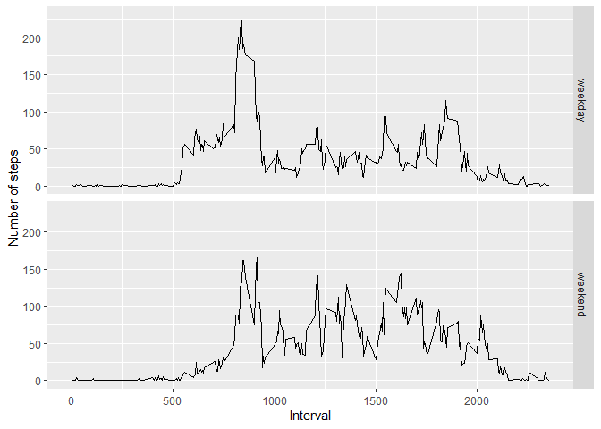

## Loading and preprocessing the data


```r
# Load libraries
library(readr)
library(dplyr)
```

```
## Warning: package 'dplyr' was built under R version 4.1.3
```

```
## 
## Attaching package: 'dplyr'
```

```
## The following objects are masked from 'package:stats':
## 
##     filter, lag
```

```
## The following objects are masked from 'package:base':
## 
##     intersect, setdiff, setequal, union
```

```r
library(ggplot2)

# Download Data Set if necessary
zipname <- "repdata_data_activity.zip"
filename<- "activity.csv"
# Checking if data set file already exists
if (!file.exists(zipname)){
  fileURL <- "https://d396qusza40orc.cloudfront.net/repdata%2Fdata%2Factivity.zip"
  download.file(fileURL, destfile = zipname, method="curl")
}
# Checking if folder with data set exists
if (!file.exists(filename)) { 
  unzip(zipname) 
}
```


```r
# Import data
ACT <- read_csv("activity.csv", col_types = cols(date = col_date(format = "%Y-%m-%d")))
```


## What is mean total number of steps taken per day?


```r
# Calculate the total number of steps taken per day
TotStepsDay<-tapply(ACT$steps,ACT$date,sum);

# Make a histogram of the total number of steps taken each day
hist(TotStepsDay,xlab="Total Steps per Day",main="",col="white")
```

<!-- -->

```r
# Calculate and report the mean and median of the total number of steps 
# taken per day
MeanStepsDay<-mean(TotStepsDay,na.rm=TRUE)

MedianStepsDay<-median(TotStepsDay,na.rm=TRUE)
```

The mean and median of the total number of steps taken per day are 10766.19 and 10765 respectively.

## What is the average daily activity pattern?


```r
# Make a time series plot (i.e. type = "l") of the 5-minute interval 
# (x-axis) and the average number of steps taken, averaged across all days 
# (y-axis)

MeanStepsInterval<-tapply(ACT$steps,ACT$interval,mean,na.rm=TRUE)

plot(unique(ACT$interval),MeanStepsInterval,type="l",
     xlab="5-minute interval",ylab="Average number of steps")
```

<!-- -->

```r
# Which 5-minute interval, on average across all the days in the dataset, 
# contains the maximum number of steps?

IntervalwithMaxSteps <- MeanStepsInterval[which.max(MeanStepsInterval)]
```

The 5-minute interval with the maximum number of steps is 835.


## Imputing missing values


```r
# Calculate and report the total number of missing values in the dataset 
# (i.e. the total number of rows with NAs)

TotNAs <-sum(is.na(ACT$steps))

PercentNAs <- TotNAs/dim(ACT)[1]*100
```

The total number of NAs in the dataset is 2304. That is 13.11% of the dataset.


##### -) Devise a strategy for filling in all of the missing values in the dataset. The strategy does not need to be sophisticated. For example, you could use the mean/median for that day, or the mean for that 5-minute interval, etc.

Answer: Substitute NAs by the mean of the corresponding 5-minute interval


```r
# Create a new dataset that is equal to the original dataset but with the 
# missing data filled in.

ACT2 <- ACT;

ACT2$aux<-as.numeric(is.na(ACT2$steps))*(MeanStepsInterval[as.character(ACT2$interval)]);

baseR.sbst.rssgn   <- function(x) { x[is.na(x)] <- 0; x }
ACT2$steps<-baseR.sbst.rssgn(ACT2$steps)
ACT2$aux<-baseR.sbst.rssgn(ACT2$aux)
ACT2$steps<-ACT2$steps+ACT2$aux;
ACT2$aux=NULL;

# Make a histogram of the total number of steps taken each day and Calculate
# and report the mean and median total number of steps taken per day. 
# Do these values differ from the estimates from the first part of the 
# assignment? What is the impact of imputing missing data on the estimates 
# of the total daily number of steps?

# Calculate the total number of steps taken per day
TotStepsDay2<-tapply(ACT2$steps,ACT$date,sum)

# Make a histogram of the total number of steps taken each day
hist(TotStepsDay2,xlab="Total Steps per Day",main="",col="white")
```

<!-- -->

```r
# Calculate and report the mean and median of the total number of steps 
# taken per day
MeanStepsDay2<-mean(TotStepsDay2,na.rm=TRUE)

MedianStepsDay2<-median(TotStepsDay2,na.rm=TRUE)
```

The mean and median of the total number of steps taken per day are 10766.19 and 10766.19 respectively.

##### -) Do these values differ from the estimates from the first part of the assignment? What is the impact of imputing missing data on the estimates of the total daily number of steps?

Answer: The "Total Steps per day" now has the previous average value where there were NAs before. Accordingly, the histogram shows that the frequency of the mean/median bar has increased. The mean and median remains the same.

## Are there differences in activity patterns between weekdays and weekends?


```r
# Create a new factor variable in the dataset with two levels – “weekday” 
# and “weekend” indicating whether a given date is a weekday or weekend day.

Sys.setlocale(category = "LC_ALL", locale = "english")
```

```
## [1] "LC_COLLATE=English_United States.1252;LC_CTYPE=English_United States.1252;LC_MONETARY=English_United States.1252;LC_NUMERIC=C;LC_TIME=English_United States.1252"
```

```r
ACT2$daytype <- ( weekdays(ACT2$date)=="Saturday" | weekdays(ACT2$date)=="Sunday" )

ACT2$daytype <- factor(ACT2$daytype,
                       levels = c("FALSE","TRUE"),
                       labels = c("weekday","weekend"))

# Make a panel plot containing a time series plot (i.e. type = "l") of the 
# 5-minute interval (x-axis) and the average number of steps taken, averaged
# across all weekday days or weekend days (y-axis). See the README file in 
# the GitHub repository to see an example of what this plot should look like
# using simulated data.

# Group observations by day type and interval
groupdata<-group_by(ACT2, ACT2$daytype, ACT2$interval)
# Calculate mean steps
summgroupdata<-summarize(groupdata,MeanSteps=mean(steps))
```

```
## `summarise()` has grouped output by 'ACT2$daytype'. You can override using the
## `.groups` argument.
```

```r
# Plot
p<-ggplot(summgroupdata, aes(`ACT2$interval`, MeanSteps))+geom_line(size=.5)
myplot<-p+facet_grid(rows=vars(`ACT2$daytype`))+labs(x="Interval", y="Number of steps")
print(myplot)
```

<!-- -->
